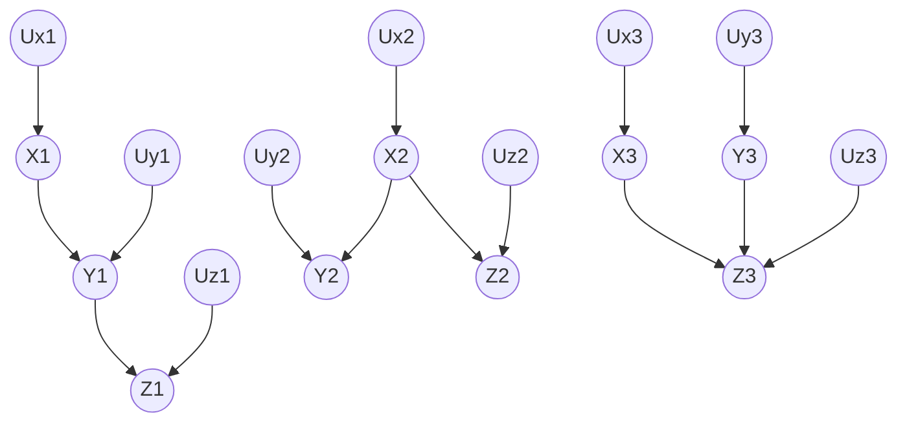

上一篇的综述论文读的比较懵。为此，从这一篇开始记录Judea Pearl的Causal Inference in Statistics: A Primer的阅读笔记，将经典的因果推断理论基础打好后再考虑机器学习领域的因果推断。
<!--more-->

## 结构因果模型
- 结构因果模型（Structural Causal Model, SCM）
结构因果模型使用有向图（通常为有向无环图，Directed Acyclic Graph, DAG）来建模变量间的因果关系。

### 基本概念
- 外源变量（exogenous variables）$U$：处在模型之外（指模型中没有指向它的原因变量）的变量，无需建模其他变量指向它的因果。在因果有向图中，外源变量全部为根节点。外源变量一般充当内源变量的误差项（在模型建模的因果关系外影响内源变量取值的因素）。
- 内源变量（endogenous variables）$V$：模型内（建模）的变量。每个内源变量被至少一个外源变量指向（存在有向边）。
- 映射函数 $f$：从原因变量到结果变量的映射函数，解释因果关系如何产生作用。

### 乘积分解规则
- 乘积分解规则（rule of product decomposition）
使用因果变量间的条件概率的乘积分解所有变量的联合概率：
$$
P(x_1,x_2,\ldots,x_n)=\prod_i P(x_i|pa_i)
$$
其中$pa_i$表示变量$X_i$的父节点变量的取值。例如，已知链状有向因果图$X\to Y\to Z$，则它们的取值的联合概率为：
$$
P(X=x,Y=y,Z=z) = P(X=x)P(Y=y|X=x)P(Z=z|Y=y)
$$

## 有向图模型
- 结构因果模型中的有向图模型及其应用
根据图的构型，将有向图模型分为三类：
- Chains：$X\to Y\to Z$，链状连接
- Forks：$X\to Y, X\to Z$，一个原因变量决定所有结果变量。其中那唯一的原因变量被称作common cause
- Colliders：$X\to Z, Y\to Z$，所有原因变量决定一个结果变量（碰撞节点，collision node）

上图从左到右每个连通图依次为Chains, Forks, Colliders。其中U*表示外源变量。

### Chains & Forks & Colliders 中的三条独立性规则
**R1.** Chains中的条件独立性：给定两个变量$X$和$Y$，称它们在给定变量$Z$时是独立的，如果$X$和$Y$之间只有一条单向路径，并且该路径被$Z$截断。

*解释：如果$X\to...\to Z\to...\to Y$且$X$到$Y$的路径只有这一条，那么他俩就是关于$Z$条件独立的。*

**R2.** Forks中的条件独立性：如果变量$X$是变量$Y$和变量$Z$的唯一原因变量，那么变量$Y$和$Z$是关于$X$条件独立的。

*理解：当$X$固定时，唯一影响$Y$和$Z$的取值的只有它们各自的外源变量$U_y$和$U_z$。由于$U_y$和$U_z$是独立的（外源变量不依赖于任何其他变量），因此$Y$和$Z$是条件独立的。*

**R3.** Colliders中的条件独立性：如果变量$Z$是$X$和$Y$的碰撞节点，并且$X$和$Y$之间只有这一条路径（注意，不仅是有向路径），那么$X$和$Y$在无条件时是独立的，但在给定$Z$或$Z$的任意后继节点时是条件不独立的。

*理解：R3是对因果关系的研究中极其重要的一条规则！它可以理解为，如果结果变量$Z$是固定的，那么当$X$的值改变时，需要改变$Y$的值，从而补偿$X$对$Z$造成的影响。例如一次考试包含理论、实验两部分。那么“总分”就是“理论分”和“实验分”的碰撞节点。如果总分固定，且某人的理论分较高，那么它的实验分必须较低从而使总分固定，反之亦然。那么理论分和实验分就是关于总分条件不独立的。*

## 有向分离&有向连接(d-*)
- 有向分离：d-seperation（‘d’的意思是directional）用于识别节点对处于的状态（有向分离态或有向连接态）的过程。
- 有向连接态：d-connected，表示存在连接两个节点的路径。有向连接态的节点对是不独立（一个依赖另一个）的。
- 有向分离态：d-seperated，表示不存在连接两个节点的路径。有向分离态的节点对一定是独立的。

判断一对节点是否是有向分离态的，其方法在于判断连接它们的所有路径（注意，不是有向路径）是否都是**阻断**的（blocked）。如果所有路径都是阻断的，那么此二者就是有向分离态的，否则它们是有向连接态的。

- 如果“依赖性”不能从某个节点沿着经过节点$Z$（对$Z$不取条件）的路径传递到另一个节点，那么称$Z$阻断这条路径。
- 被阻断的对象是连接两个节点的一条路径，而不是两个节点。
- 如果节点$Z$是节点$X$和$Y$的一条路径上的碰撞节点（collider），那么$Z$必然是能够阻断这条路径的。

除了碰撞节点，还有满足以下条件的节点能够阻断一条路径：
- 如果我们对一个**节点集**$K$取条件（即固定节点集中的变量的值），且节点$Z$满足：
  - $Z$是碰撞节点且$Z\notin K$，且$Z$的任意后继节点都不属于$K$
  - $Z\in K$且$Z$是一个chain或fork的中间节点

满足上述任意一种条件的节点$Z$都能阻断条件中提及的路径。

基于“阻断”的定义，我们可以给出有向分离的定义：

---
**定义（有向分离，d-separation）**：一条路径$p$能够被一个节点集$Z$阻断，当且仅当：
1. $p$包含chain $A\to B\to C$或fork $A\leftarrow B\to C$使得中间节点$B\in Z$（即$B$取条件），或
2. $p$包含collider $A\to B\leftarrow C$使得碰撞节点$B\notin Z$，且$B$的任意后继节点都不属于$Z$。

若上述节点集$Z$阻断节点$X$和$Y$之间的所有路径，那么称$X$和$Y$是关于$Z$有向分离的（d-separated, conditional on $Z$），因此是关于$Z$条件独立的。

---

<section class="post-full-comments">
    <link rel="stylesheet" href="https://cdn.jsdelivr.net/npm/gitalk@1/dist/gitalk.css">
    
    

    
</section>