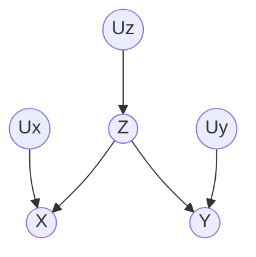
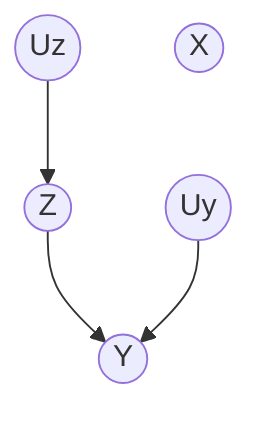
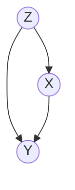
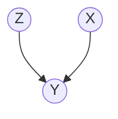

因果推断中的干预概念。

<!--more-->
上一篇主要讲因果模型的形式化表示方法（结构因果模型）。从这一篇开始，主要围绕如何在现实场景中推断因果的问题展开叙述。首先，最理想的因果推断方法是随机化控制实验（randomized controlled experiments），即通过控制变量的随机化试验验证变量间的因果关系（问题如：统计数据表明纸尿裤和啤酒的销量成正相关，那么他俩之间存在因果关系吗？）。然而，随机化控制实验的要求过于严苛，以至于难以实行（例如，难以同时控制纸尿裤和啤酒的销量）。因此研究者试图通过观测研究（observational studies）探索因果关系，从中只记录数据，不控制变量。然而，记录的数据只能呈现相关性，不能呈现因果性。在此背景下，干预（intervention）作为一种因果推断的方法出现了。通俗而言，“干预”是指通过控制某些变量、观察其他变量的变化，从而验证因果性。例如，为了干预纸尿裤的销量，可以在试验期间关闭超市的纸尿裤贩售区（前提是和超市达成合作协议）。

## 干预
- 干预（intervention）：**固定**某些变量，**改变**整个系统，观察其他变量的变化
  - 与取条件（conditioning）的区别：取条件时，在行为上不固定/改变任何变量，仅仅“关注”被取条件的变量取某些固定值时，整个系统的状态。
  - 例：关闭纸尿裤贩售区，观察啤酒销量，是为干预；照常卖纸尿裤和啤酒，只看当纸尿裤数量小于1000时啤酒的销量，是为取条件。

在结构因果模型的有向图中，对某个变量的干预可以理解为**删去图中所有指向该变量的有向边**。例如：

干预前：

对$X$实施干预后：

注意到$U_x$是外源变量，不需要SCM负责建模。当$U_x$与$X$之间的有向边删去后，$U_x$没用就可以丢弃了。

### do-操作
上文已讲，干预和取条件是两种不同的概念。为了对二者加以区分，使用do-操作表示干预。例如，如果通过干预使得变量$X$取值为$x$，则记为$do(X=x)$；如果取条件，则是$X=x$。在变量分布的意义上，
- $P(Y=y|X=x)$表示**当样本的$X=x$时**，$Y$的分布；
- $P(Y=y|do(X=x))$表示**令所有样本的$X=x$时**，$Y$的分布。

基于do操作，我们马上可以定义出因果效应差，即因果效应的强度：
$$
P(Y=1|do(X=1))-P(Y=1|do(X=0))
$$
而这正是[学习笔记2中记录的ACE](https://cslijt.github.io/LiJT-Daily/2022/04/21/2022-04-21-casual-inference-2/)。

### Adjustment formula
Adjustment formula描述了通过干预前分布推断干预后分布的方法，定义如下。其具体推导见参考文献1 p56-57.
$$
P(Y=y|do(X=x))=\sum_z P(Y=y|X=x,Z=z)P(Z=z)
$$

需要注意的是$Z$必须是$X$的父节点。下面给出Adjustment formula的严谨的形式化定义：

---
**R1. 因果效应规则（The Causal Effect Rule）**：给定有向图$G$，节点$X$和它的父节点（可能多个）$PA$，则$X$对$Y$的因果效应被定义为：
$$
P(Y=y|do(X=x))=\sum_z P(Y=y|X=x,PA=z)P(PA=z)
$$
其中$z$为所有属于$PA$的节点的联合取值。

---
Adjust formula对应模型-干预前：

Adjust formula对应模型-干预后：

Adjust formula提供了一种仅依靠观测数据（不用干预！）计算因果效应的方法。但该方法有一缺陷，即要求原因变量$X$的所有被SCM所假设的父节点都是可观测的。下面着手解决部分父节点不可观测时如何计算因果效应的问题。

## 参考文献
1. Judea Pearl, Madlyn Glymour, Nicholas P.Jewell.Causal Inference in Statistics: A Primer.2016.WILEY

<section class="post-full-comments">
    <link rel="stylesheet" href="https://cdn.jsdelivr.net/npm/gitalk@1/dist/gitalk.css">
    
    

    
</section>